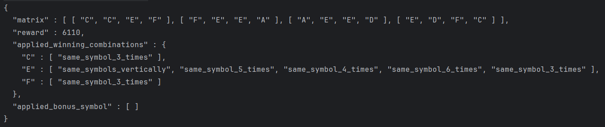

# Home Assignment: Scratch Game #
Problem statement: You need to build a scratch game, that will generate a matrix (for example 3x3) from symbols(based on probabilities for each individual cell) and based on winning combintations user either will win or lost.
User will place a bet with any amount which we call *betting amount* in this assignment.

## Environment Requirements (Windows):

- **Java Development Kit (JDK)**:
    - Java 1.8

- **To check if Java is installed:**
    - Open your terminal/command prompt and run:
      ```bash
      java -version
      ```
- **Setup Java Environment**:
  If Java 1.8 is not installed, download and install it from the
  official [Oracle JDK website](https://www.oracle.com/java/technologies/javase-jdk11-downloads.html) or
  use [OpenJDK](https://adoptopenjdk.net/).

## Steps to Run Test:

1. **Run Test**:
    - Go to specific dir and open the terminal, run the following command in your terminal:
      ```bash
      mvn test
      ```

## Steps to Compile and Run:

1. **Compile the Code**:
    - To compile the code, run the following command in your terminal:
      ```bash
      mvn clean package
      ```
    - if you want to ignore the tests and build
      ```bash
      mvn clean package -DskipTests
      ```

2. **Run the application with test**:
    - Find the scratch-game.jar from the target directory:
    - run the following command in your terminal
      ```bash
      java -jar scratch-game.jar --config config.json --betting-amount 100
      ```
3. **Run in IDE**
   


## Application Works ##
1. **Won Game**

    

2. **Loss Game**

    

3. **Bonus earn**

    